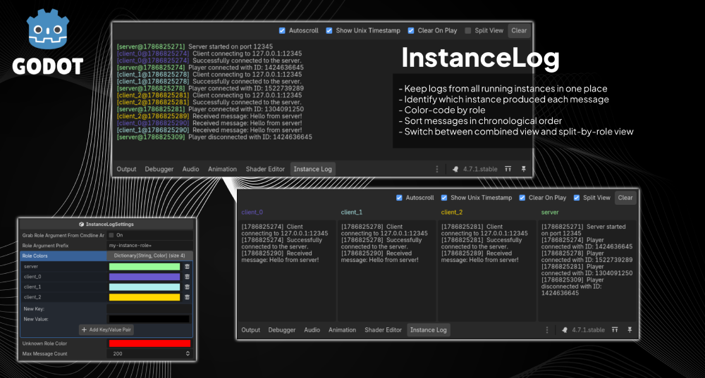

# Instance Log (for Godot)

Instance Log is a Godot editor plugin for debugging projects that run multiple
game instances at once (for example, host + clients in multiplayer tests).

It adds an **Instance Log** panel next to Godot's Output panel and groups each
message by instance role (like `server`, `client_0`, `client_1`) with color
tags.



## Why use it?

When you run several instances at the same time, regular `print()` output can
get hard to read quickly. It can be hard to tell which instance produced each
message, and the output can arrive in a non-chronological order, leaving you to
guess whether your networked code is working correctly.

Instance Log lets you:

- Keep logs from all running instances in one place
- Identify which instance produced each message
- Color-code by role
- Sort messages in chronological order
- Switch between combined view and split-by-role view

## Features

- Editor bottom panel named **Instance Log**
- Per-instance session tracking through `EditorDebuggerPlugin`
- Role-aware logging with configurable role colors
- Set role from code or command-line argument
- Toolbar controls:
  - Autoscroll
  - Show Unix Timestamp
  - Clear On Play
  - Split View
  - Clear
- Bounded message history via max message count setting

## Installation

1. Copy the `addons/instance_log` folder into your Godot project. (Download this
   repository as a .zip or download from
   [releases](https://github.com/codevogel/godot_instance_log/releases/latest)
2. In Godot, open **Project > Project Settings > Plugins**.
3. Enable **Instance Log**.

## Quick Start

### 1. Log through the plugin API

Use either class:

```gdscript
InstanceLog.print("Hello from this instance")
```

or shorthand:

```gdscript
IL.print("Hello from this instance")
```

### 2. Assign a role

#### 2a. Set role from command-line argument

Set role manually from code:

```gdscript
IL.set_role_id("server")
# or
IL.set_role_id("client_0")
```

Then call `IL.print(...)` as usual.

#### 2b. Set role from launch argument

You can configure the plugin to read a role from launch arguments.

By default, the role argument prefix is:

```text
my-instance-role=
```

Examples:

```text
godot --my-instance-role=server
godot --my-instance-role=client_0
```

In Godot, you can set launch arguments in: **Debug > Customize Run Instances**.

Important:

- Enable role parsing in the settings resource
  (`_grab_role_argument_from_cmdline_args = true`).
- If role parsing is disabled, call `IL.set_role_id(...)` manually.

### 3. Run multiple instances

Start host/client instances (or any multi-instance setup).

Open the **Instance Log** bottom panel to view tagged output from all connected
instances.

## Command-line Role Assignment

## Settings

Plugin settings are stored in:

- `addons/instance_log/instance_log_settings.tres`

Script class:

- `InstanceLogSettings` in `addons/instance_log/instance_log_settings.gd`

Key fields:

- `_grab_role_argument_from_cmdline_args` (bool)
- `_role_argument_prefix` (String)
- `_role_colors` (Dictionary[String, Color])
- `_unknown_role_color` (Color)
- `_max_message_count` (int)

## API Reference

### `InstanceLog`

- `InstanceLog.print(message: Variant) -> void`
  - Prints to normal Output and forwards the message to the Instance Log dock.
- `InstanceLog.set_role_id(role_id: String) -> void`
  - Sets role used in tags.

### `IL` (shorthand)

Does the same as `InstanceLog` but is shorter to type.

- `IL.print(message: String) -> void`
- `IL.set_role_id(role_id: String) -> void`

## Example Scene

This repository includes a sample scene under `example/` that demonstrates
host/client logging.

Flow in the sample:

- Host sets `IL.set_role_id("server")`
- Client sets `IL.set_role_id("client_x")`
- Both sides call `IL.print(...)`
- Messages appear in the dock with role tags and colors

Clients can send a message to the host, and the host can send a message to all
clients (with simulated network latency).

## How it works

1. Runtime code calls `InstanceLog.print(...)`, storing a unix time stamp along
   with the message.
2. If debugger is active, it forwards payload via
   `EngineDebugger.send_message("instance_log:print", [...])`.
3. Editor-side debugger plugin captures `instance_log:*` messages.
4. Dock receives signal, stores/sorts/prunes messages, and redraws the UI.

## Notes

- Messages still appear in regular Output, so existing workflow is preserved.
- The dock only receives forwarded messages while connected through the
  debugger.
- Large max message counts may impact editor redraw performance. This is because
  the plugin redraws the entire message list on each new message, in order to
  keep messages sorted by timestamp. You may want to reduce the max message
  count if you have a lot of logs and notice lag in the editor.
